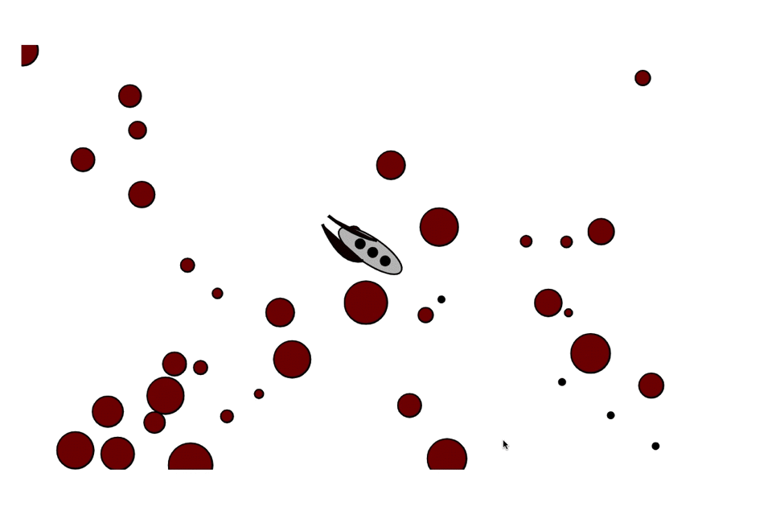
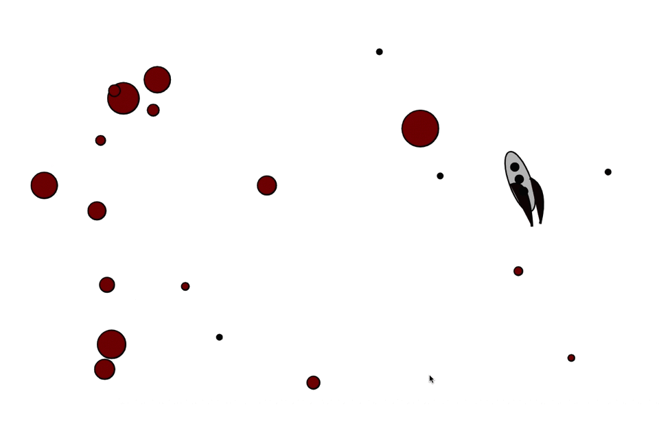

# Asteroids

My solution to a javascript practice exercise earlier this year. The purpose was to become familiar with the structure of prototype inheritance. For this reason, classes are written with ES5 syntax. Images are rendered using the Canvas API (https://developer.mozilla.org/en-US/docs/Web/API/Canvas_API)

